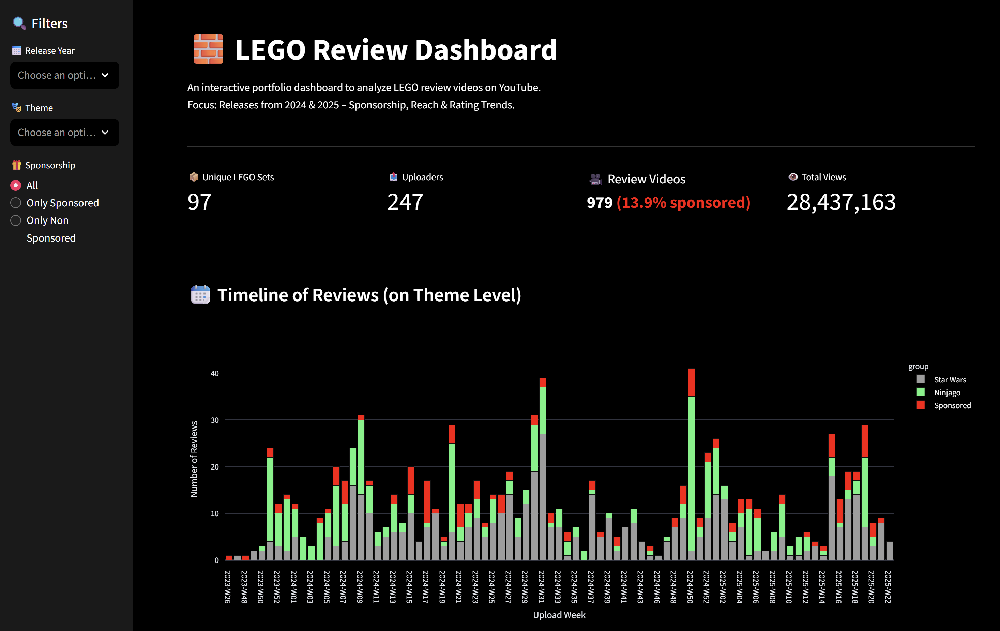

# 🧱 LEGO Review Intelligence – A Full Stack Data Science Project

Analyze the YouTube ecosystem of LEGO reviews using local LLMs and interactive dashboards.

---

## 🎯 What This Project Does

This project automatically:

1. **Finds LEGO review videos on YouTube** using the set number
2. **Extracts & stores video transcripts**
3. **Analyzes sentiment & detects sponsorships** using a local LLM (e.g. LLaMA 3 via Ollama)
4. **Visualizes trends and insights** in a Streamlit dashboard ([LIVE-DEMO](https://groegman.com/lego_dashboard/))

## Example Dashboard

---

## 🧠 Key Skills & Technologies

| Category           | Tools Used                                                                 |
|--------------------|----------------------------------------------------------------------------|
| **ETL & APIs**     | `yt-dlp`, `requests`, YouTube scraping                                     |
| **Data Processing**| `SQLite`, `Pandas`, structured JSON                                        |
| **LLM Analysis**   | `LangChain`, `Ollama`, prompt engineering, sentiment/sponsorship detection |
| **Dashboard**      | `Streamlit`, `Plotly`, dark theme, filterable UI                           |

---

## 🔁 Workflow Overview

1. LEGO Set List (CSV) --> YouTube Search via yt-dlp
2. Store Metadata + Transcripts in SQLite
3. LLM Analysis via LangChain & Ollama
4. Streamlit Dashboard

## 🛠️ How to Use (Local Setup)

1. Clone this repository
2. Install dependencies:  
   `pip install -r requirements.txt`
3. Run the YouTube extraction script:  
   `python yt_extract.py`
4. Run the transcript analyzer:  
   `python analyze_transcripts.py`
5. Start the dashboard:  
   `streamlit run lego.py`

Make sure `ollama` is running locally and a model (e.g., `llama3`) is available.

---

## Data Sources

- LEGO Set metadata ([brickset.com](https://brickset.com/))
- Public YouTube metadata and auto-captions

---

## License

MIT License